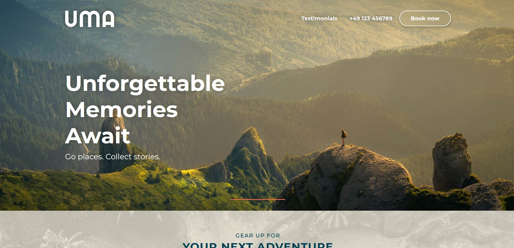
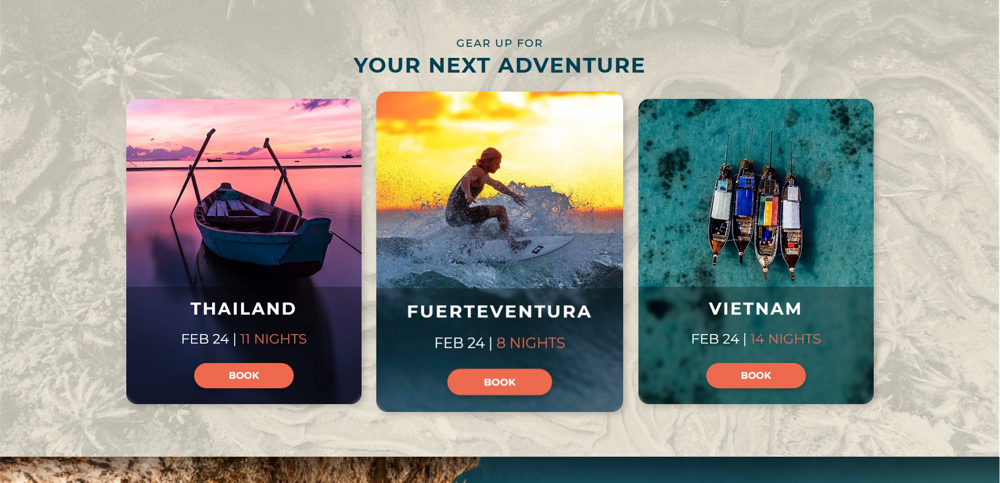
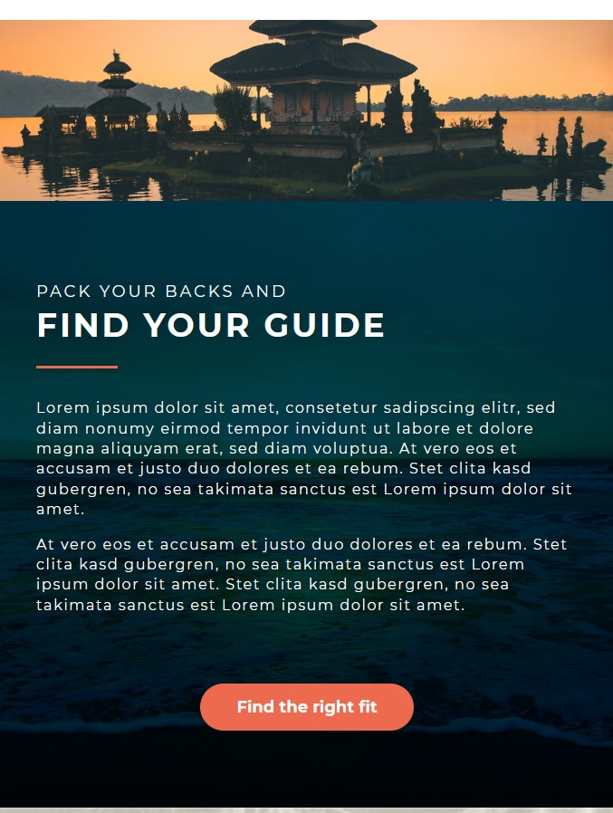
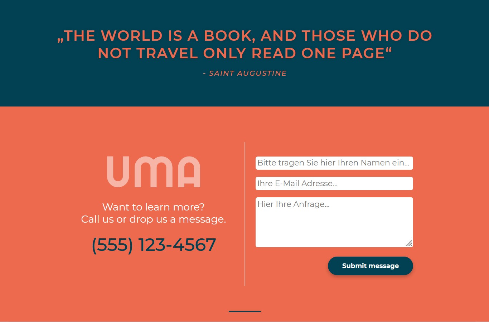

# 🌴 Reisewebsite - UMA

Eine responsive fiktive Reisewebsite - erstellt im Online-Kurs.

---

## 🚀 Features

- Reisewebsite mit verschiedenen Sektionen und Designelementen
- 100% responsive

---

## 📷 Screenshots

---

## 🛠️ Verwendete Technologien

| Tool / Library                                                   | Purpose               |
|------------------------------------------------------------------|-----------------------|
| HTML5 & CSS3                          | Language  |
| [Montserrat](https://fonts.google.com/specimen/Montserrat)                                                          | Font           |

---

## 💻 Installation/Ausführung

### Im Browser

1. Projekt klonen: `git clone https://github.com/Hannes2806/Reisewebsite-UMA.git`
2. `index.html` im Browser ausführen (z.B. Firefox)

## 📄 Licence

Dieses Projekt wurde im Rahmen dieses [Onlinekurses](https://www.udemy.com/course/html5-und-css3/?kw=html&src=sac&couponCode=ST4MT20725G2) erstellt und entspricht der im Kurs gegebenen Lizenzvereinbarung. 

## Author

Hannes F. Martens, in Anlehnung an dem [Kursprojekt](https://www.udemy.com/course/html5-und-css3/?kw=html&src=sac&couponCode=ST4MT20725G2)
